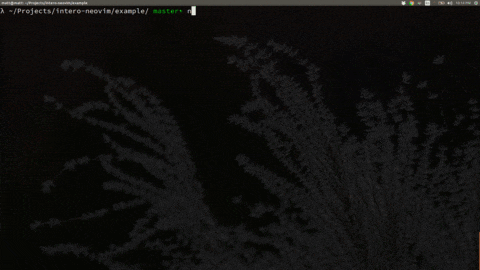
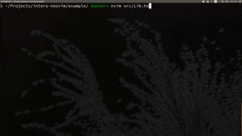

# `intero-neovim` : v1.0.0
[](https://travis-ci.org/parsonsmatt/intero-neovim)

Get the lightning fast type information and go-to-definition that Intero
provides without going to the dark side of emacs!

## Installing

This plugin is compatible with `pathogen`, `vim-plug`, etc.



## Usage

This plugin provides an integration with [Intero][] via Neovim's terminal and
asynchronous job control. You might like the following shortcuts:

```
" Process management:
nnoremap <Leader>hio :InteroOpen<CR>
nnoremap <Leader>hik :InteroKill<CR>
nnoremap <Leader>hic :InteroHide<CR>
nnoremap <Leader>hil :InteroLoadCurrentModule<CR>

" REPL commands
nnoremap <Leader>hie :InteroEval<CR>
nnoremap <Leader>hit :InteroGenericType<CR>
nnoremap <Leader>hiT :InteroType<CR>
nnoremap <Leader>hii :InteroInfo<CR>
nnoremap <Leader>hiI :InteroTypeInsert<CR>

" Go to definition:
nnoremap <Leader>hid :InteroGoToDef<CR>

" Highlight uses of identifier:
nnoremap <Leader>hiu :InteroUses<CR>

" Reload the file in Intero after saving
autocmd! BufWritePost *.hs InteroReload
```



## Commands

The following commands are available:

### `InteroEval`

This prompts the user to input a string, which gets sent to the REPL and
evaluated by Intero.

### `InteroResponse`

This retrieves the last thing that was evaluated by `intero`.

### `InteroGenericType`

This gets the type at the current point.

### `InteroTypeInsert`

Inserts the type of the current identifier in the above line at the top level.

### `InteroType`

This gets the type at the current point without generalizing the term.

### `InteroUses`

Highlights all uses of the current identifier and sets it to be the search
term. Also runs the command `:uses` in the Intero REPL.

### `InteroGoToDef`

Jumps to the definition of the current item if it is defined in the same
package. Otherwise, echoes where it is defined.

### `InteroReload`

Issues a `:r` to the REPL, causing it to reload the current module set.

### `InteroLoadCurrentModule`

This loads the current module.

### `InteroOpen`

Opens the Intero terminal buffer.

### `InteroHide`

Hides the Intero buffer without killing the process.

### `InteroStart`

This starts an Intero process connected to a `terminal` buffer. It's hidden at
first.

### `InteroKill`

Kills the Intero process and buffer.

## Configuration

If you need to use a specific `stack.yaml` file, you can set either of `STACK_YAML`
or `g:intero_stack_yaml` before invoking a command.

If you use a custom prompt in GHCi, then you may need to modify the regex for it. The default is

    let g:Intero_prompt_regex = '[^-]> '

## Completion

Completion is not handled by this plugin. Check out [neco-ghc][] for fast
autocompletion using `deoplete` or `omnicomplete`. If you have good reason for
wanting Intero-provided completion, please [post in the related
issue](https://github.com/parsonsmatt/intero-neovim/issues/5).

## Known Issues
* some commands may have unexpected side-effects if you have a autocmd that automatically switches to insert mode when entering a terminal buffer

## License

[BSD3 License](http://www.opensource.org/licenses/BSD-3-Clause), the same license as ghcmod-vim.

[intero]: https://github.com/commercialhaskell/intero
[neco-ghc]: https://github.com/eagletmt/neco-ghc
